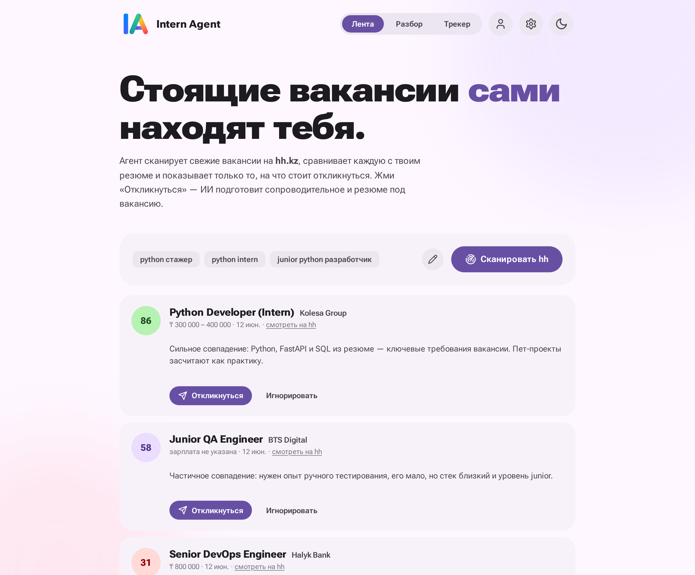
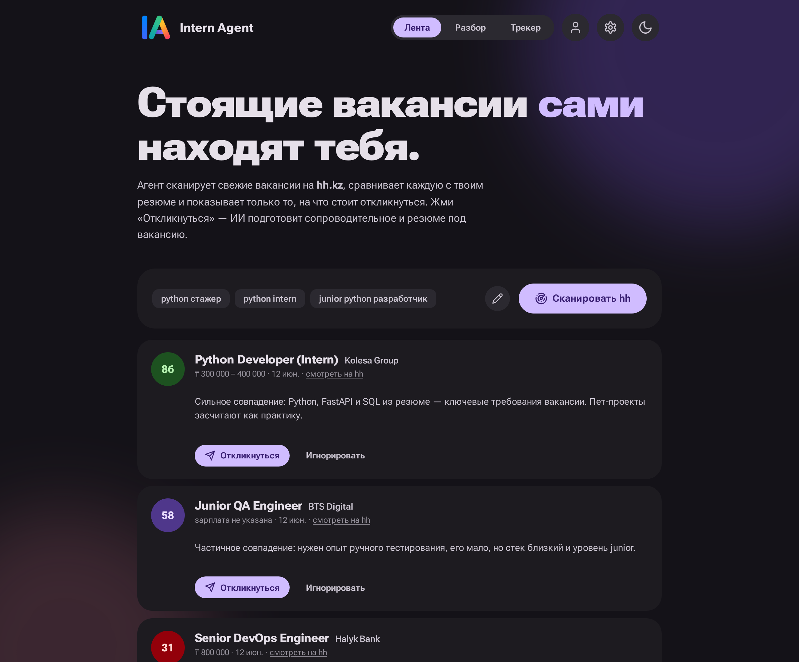

<div align="center">


# Intern Agent

**AI agent that finds internships on hh.kz and prepares your applications for you**

[](https://github.com/Dex719/intern-agent/actions/workflows/ci.yml)


**[🚀 Live demo](https://intern-agent-production.up.railway.app/)**



</div>

---

The agent scans fresh vacancies on **hh.kz** by your search queries, scores each one against your resume with an LLM and shows only the ones worth applying to. One click on **Apply** — and the AI writes a cover letter and tailors your resume for that exact vacancy.

> No invented experience: the agent works strictly with facts from your resume.

## Features

| | |
|---|---|
| 📡 **Vacancy feed** | searches hh.kz, screens every new vacancy against your resume in a single LLM pass and ranks them by score; ignore or apply in one click |
| ⏰ **Scheduled auto-scan** | background scanning every N hours + Telegram notifications for high-score vacancies |
| 🤖 **Telegram bot** | cover letters for good matches land right in your chat — copy and send |
| 🔗 **hh account linking (OAuth)** | connect your hh.ru/hh.kz account and the agent applies for you with a tailored cover letter |
| ✍️ **Semi-auto mode** | no hh dev app? The agent still writes a cover letter for every good match and sends it to Telegram with the vacancy link |
| 🎯 **Match score 0–100** | an honest verdict: is it worth applying, what you already cover and what is missing |
| 📝 **Resume tailored to the vacancy** | your facts, reordered and rephrased for the role |
| 💌 **Cover letters** | in Russian and English, ready to send |
| 📊 **Application tracker** | every analysis is saved with a status pipeline: analyzed → applied → reply → interview → offer / rejected |
| 🧠 **7 LLM providers** | Gemini, OpenAI, Anthropic, OpenRouter, Groq, DeepSeek, Mistral — your own API key, selectable in the UI |
| 🔐 **Password login** | single-user auth: PBKDF2 hashing + httpOnly session cookies, set on first launch |
| 🪵 **Built-in logs viewer** | recent scan/LLM/auth events right in the UI |

## How it works

```
search queries ──► hh search (api.hh.ru ──► fallback: hh.kz HTML)
                        │ new vacancy ids
hh.kz link ─────────────┤ details: hh API ──► fallback: JSON-LD from the page
raw vacancy text ───────┤
                        ▼
   your resume + vacancies ──► LLM (strict JSON response schema)
                        ▼
   feed scores ──► Apply: tailored resume + cover letters ──► SQLite tracker
```

- **Vacancy fetching** — official open hh API first; if it's unavailable for the server IP, the agent falls back to parsing schema.org JobPosting JSON-LD straight from the vacancy page.
- **Analysis** — LLM with a strict JSON response schema (no free-form parsing).
- **Storage** — single SQLite file, no external services.

## Stack

`FastAPI` · `SQLite` · `Gemini / OpenAI / Anthropic / …` · `vanilla JS` · `Material 3 Expressive` (light/dark) · `pytest` + `ruff`

## Run locally

```bash
pip install -e ".[dev]"
export GEMINI_API_KEY=your_key        # https://aistudio.google.com/apikey
PYTHONPATH=src python -m uvicorn intern_agent.api.app:app --reload
# open http://localhost:8000
```

## Deploy (Railway)

1. Create a project from this repo — `railway.json` handles build & start.
2. Set the `GEMINI_API_KEY` variable.
3. Add a Volume mounted at `/data` and set `DB_PATH=/data/intern.db` so the tracker survives redeploys.
4. (Optional) set `TELEGRAM_BOT_TOKEN` + chat id in settings — for notifications and semi-auto mode.

## API

| Method | Path | Description |
|---|---|---|
| `GET` | `/api/health` | health check |
| `GET` / `PUT` | `/api/resume` | get / save resume |
| `POST` | `/api/analyze` | `{url}` or `{text}` → full analysis, saved to tracker |
| `GET` / `PUT` | `/api/settings` | search queries & settings |
| `POST` | `/api/scan` | scan hh by saved queries, score new vacancies into the feed |
| `GET` / `PATCH` | `/api/feed` | feed items / ignore item |
| `POST` | `/api/auth/setup` / `login` / `logout` | first-run password setup, sessions |
| `GET` | `/api/logs` | recent app events (scan, LLM, auth) |
| `GET` / `POST` | `/api/hh/connect` / `resumes` / `disconnect` | hh OAuth linking |
| `POST` | `/api/feed/{id}/apply` | generate application materials, move to tracker |
| `GET` | `/api/applications` | tracker list + stats |
| `GET` / `PATCH` / `DELETE` | `/api/applications/{id}` | detail / update status / remove |

## Tests

```bash
ruff check src tests
PYTHONPATH=src pytest -q   # 56 tests
```

## Roadmap

- [x] Scheduled auto-scan → Telegram notifications
- [x] Semi-auto mode: cover letters to Telegram without an hh app
- [ ] Response/conversion analytics in the tracker
- [ ] PDF export of the tailored resume

<div align="center">



</div>
